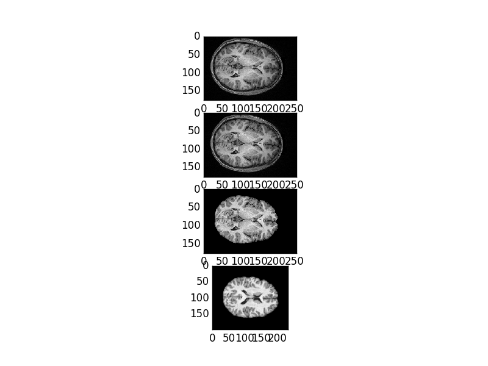
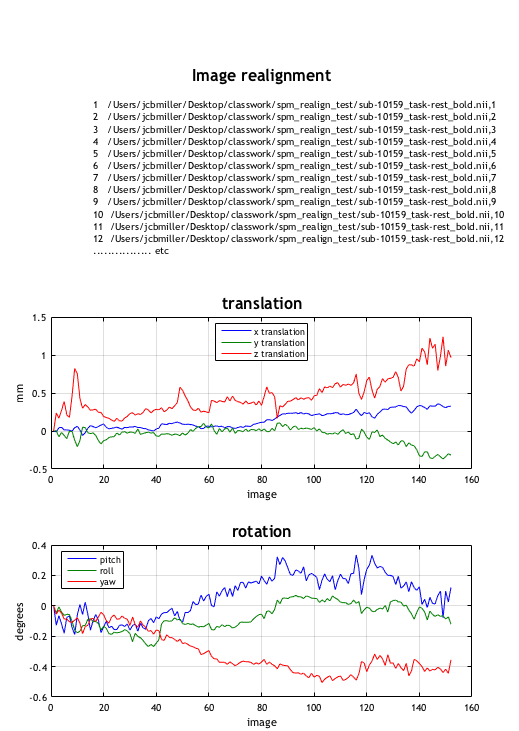
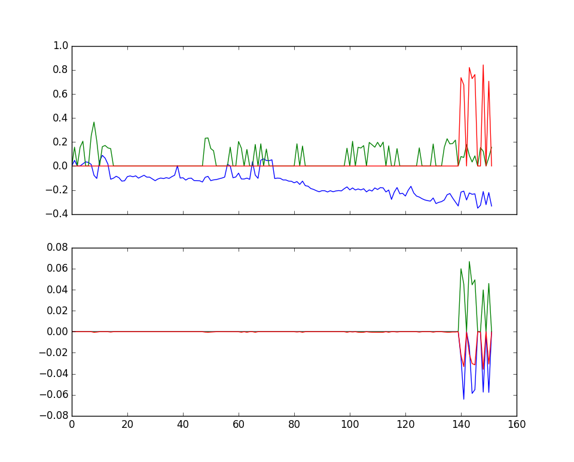
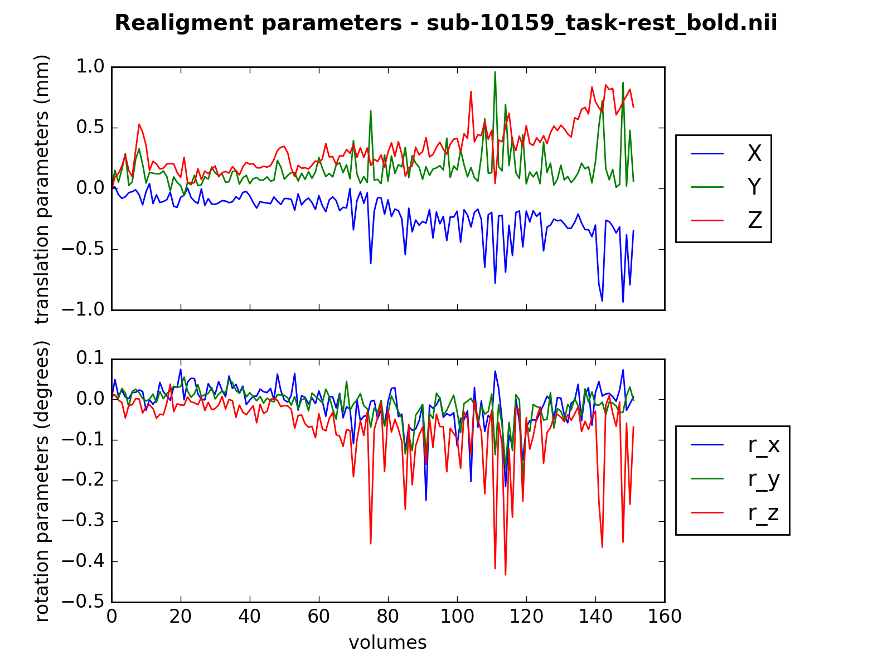
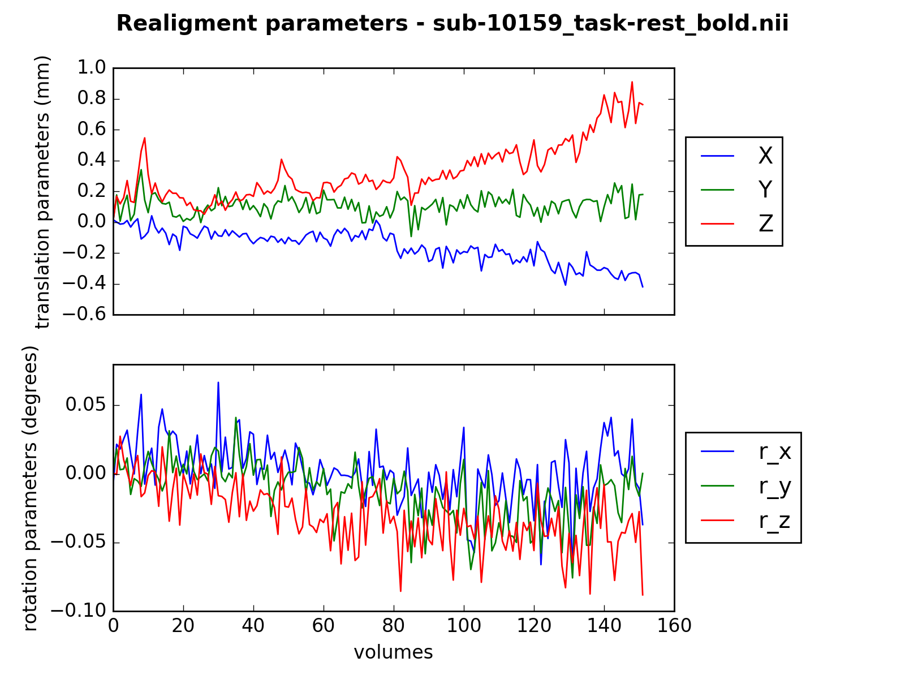
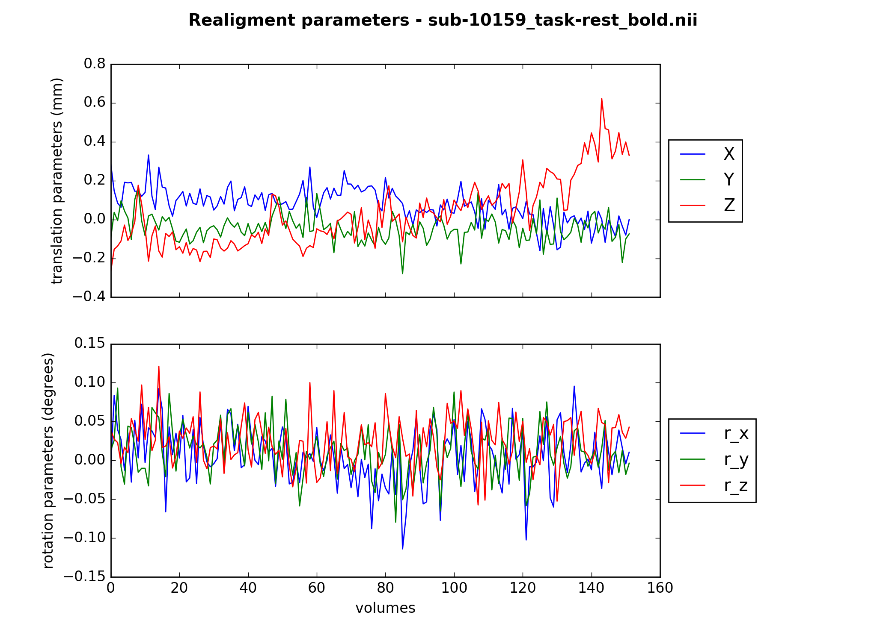

# Report

## Anatomical preprocessing
Anatomical preprocessing takes the raw T1 weighted image in order to prepare it for future steps in the preprocessing pipeline. The usual steps in anatomical preprocessing include deobliquing the image, reorienting the image to the desired space (in this case MNI/RAS+ space), performing bias reduction, and extracting the brain from the skull. For this project, MNI reorientation was performed first with the help of NIPYPE, followed by a combined bias-reduction/brain extraction with the help of NIPYPE. Finally, the T1 image was deobliqued with the help of the rigid body transformation script in the registration section of the project. All of these steps offered me a useful way to dig deeper into typical preprocessing steps. It highlighted the complexity of neuroimaging as well as the need to fully understand what is under the hood of any functions/programs used in the future.

From top to bottom: Raw T1, MNI reoriented, Skull Stripped, Deobliqued.

## Functional preprocessing
Functional preprocessing is the collective term applied to the steps taken from a raw T2 EPI data to prepare it for meaningful analysis with a model (typically, the GLM) and coregistration with an anatomical T1 volume. In SPM terminology, these steps consist of temporal (slice-timing correction) and spatial (realignment / motion correction) preprocessing. Here, we focused on the issues of motion and volumen realignment within a 4D timeseries of volumes. The presented code uses coordinate mapping between volumes to obtain realignment parameters for the 6 rigid body transforms and resample a given volume to the reference, typically the first. This framework output is then compared to SPM's realignment and reslicing functions. Options are available for the use of a first/middle reference volume, one/two realignment passes, and the level of smoothing applied to the data. Testing of these functions and their optimizaiton was done through manipulating a single volume wiht known rotations and translations, and attempting to recover them (tests/test_coord_mapping.py). 

####SPM Realignment parameters 
*(linear transform, first volume as reference)*

####First attempt at realignment
*(optimizing translations and rotations separately, no random jitter added to coordinates, first volume as reference)*

Most of the optimized realignment parameters here came back at 0. In the end, we think this results from being trapped in local minima of the voxel coordinate grid. The results after this image all then used coordinate mapping instead of affine transforms to do image resampling, with random jitter added to the cooridnate grid. As the next plots demonstrate, this approach avoided the local minima at 0 values and more closely mirrored the outputs from SPM's realignment. 

####Realignment with mapping coordinates 
*(Cooridnate mapping, random jitter, first volume as reference)*

From this point on, all images were then realigned excluding voxels with a value of 0 that were added from the resampling of the moving image 

####Realignment with mapping coordinates + smoothing 
*(Cooridnate mapping, random jitter, first volume as reference, 5mm FWHM smoothing)*

Exlcusing resampled voxels with a value of 0 from the moving image reduced the number of sharp drops in the relaignment parameters, and more closely resembled the smoother output of SPM's functionality. 

####Two-pass realignment with mapping coordinates + smoothing 
*(Cooridnate mapping, random jitter, first volume as reference, first pass: 8mm FWHM smoothing, second pass: 4mm FWHM smoothing)*

####Two-pass realignment with mapping coordinates + smoothing + realignment to mean 
*(Cooridnate mapping, random jitter first pass: 8mm FWHM smoothing w/ first volume as reference,, second pass: 4mm FWHM smoothing w/ mean functional of first pass as reference)*

These two pass relaignment methods were based on ideas from the following paper: Jenkisnon et al., NeuroImage 17, 825–841 (2002) 

Overall, the relaignment functions implemented here were able to capture some of the largest drift and overall patterns of misalignment between volumes - this can be clearly observed in the red trace in the translations plot. However, more subtle patterns of drift, especially in rotations, were not captured very well by these functions. We think this is the case because SPM employs cost funcitons and optimization using first adn second order derivatives (among other techniques) that help to avoid the trapof local minima in optimizing voluem realignment. Overall, smoothing the volumes by 5mm aided in captring overall patterns, while a two-pass approach (even to the mean functional image) did not greatly aid in the realignment process. Of note, the crucial assumption here is that the SPM realignment outputs are in face 'correct.' In reality, we cannot know this is the case. However, it serves as an important comparison of how their approach builds on the more simple methods implemented here. 

## Segmentation
The goal of segmentation is to separate the anatomical volume into CSF, white matter, and gray matter. It takes the preprocessed anatomical volume and generates three tissue probability maps, one for each of the three tissue classes. The maps contain how probable it is for each voxel to belong to a tissue class. Here, we tried to implement segmentation using k-means clustering and the Markov Random Field Expectation-Maximization (MRF-EM) method used in FSL's FAST.

### k-means clustering
k-means clustering tries to classify the voxels based on their intensity value. In each iteration of k-means, every voxel is first assigned to the cluster with the closest mean. Each cluster mean is then updated to be the mean voxel intensity value of all the voxels assigned to that cluster.

Below are examples of k-means clustering applied to the middle slice for three subjects. The leftmost image is the segmented slice and the three images to the right are the tissue probability maps. As you can see, k-means finds roughly where CSF, gray matter, and white matter are, but also labels many white matter voxels in the middle of a white matter area as gray matter and vice versa.

**Subject 10159**
![figure for s10159]
(figures/kmeans_sub-10159.png)

**Subject 10171**
![figure for s10171]
(figures/kmeans_sub-10171.png)

**Subject 10189**
![figure for s10189]
(figures/kmeans_sub-10189.png)

### MRF-EM
In k-means, each voxel was assigned a cluster based on its intensity value. However, where a voxel is located in the brain also says a lot about what kind of tissue it is. MRF-EM improves on k-means (and EM) by adding in spatial information: if two voxels are next to each other, then they probably belong in the same tissue class.

See [this](http://htmlpreview.github.com?https://github.com/psych-214-fall-2016/project-red/blob/master/report/links/MRF-EM_explain.html) page for more details! (couldn't figure out how to Latex with Markdown)

**Reference:** Zhang, Y. and Brady, M. and Smith, S. Segmentation of brain MR images through a
hidden Markov random field model and the expectation-maximization algorithm.
IEEE Trans Med Imag, 20(1):45-57, 2001.

Because MRF-EM takes a long time to run, we segmented small sections of slices from two subjects as examples. The original section and the results from k-means are also shown for comparison.

**Subject 10159**

![figure for s10159 segmentation]
(figures/mrf_s10159_segment.png)

Probability maps
![figure for s10159 maps]
(figures/mrf_s10159_pmaps.png)

**Subject 10189**

![figure for s10189 segmentation]
(figures/mrf_s10189_segment.png)

Probability maps
![figure for s10189 maps]
(figures/mrf_s10189_pmaps.png)

As shown above, the MRF-EM algorithm makes white and gray matter areas more homogeneous and tries to force neighboring pixels to have the same label. Unfortunately we did not have time to compare these segmentations with the results from FSL FAST. However, since humans are better than algorithms at segmentations, we can at least say that the implementation seems to do a decent job on the small sections. We don't know how this code will perform on an entire brain slice or volume with three tissue classes, and this is difficult to test on small sections because it is hard to find a section that has enough pixels that are CSF, gray matter, and white matter for EM to work. 

## Registration
In our code, we write our own methods to find the best full affine transformation to match two 3D images, e.g. subject T1 to the MNI template. Four successive searches find the best match (under mutual information) using increasingly more free parameters (translations, 3 parameters; plus rotations, 6 total; plus scales, 9 total; plus shears, 12 total). The first search is initialized by matching the center of mass between the two images, and each remaining optimiziation is initialized with the preceding output. We are using linear interpolation whenever resampling is required.

We are using skull-stripped images because the outside shape contributes meaningfully to the optimization procedure, and we are aiming to match brains not head/neck shapes. The examples below register the MNI template with itself or with individual subject T1 images, but the procedure is agnostic to the types of images being compared and could also be used to register individual T1 and sample T2\* volumes.

### Does the registration procedure work?
To demonstrate that our image registration procedure is effective, we change the MNI template by a known linear transformation and attempt to recover the initial transformation. The figures below can be generated with `project-red/code/fmri_utils/registration/quality_report.py` (~1 hr to run).

We transform the MNI template by translating (59, -3, -20) voxels along and rotating (0.2, -0.2, 0.5) radians around the x-, y-, an z-axes. We call the original MNI template the "static" image, and the new transformed MNI template the "moving" image.

This set of figures shows cross sections of the static image on the left, the same cross sections of moving image on the right, and the overlap in the middle (green = left, red = right, yellow = overlap).

![resampled_0]
(figures/mni_icbm152_t1_tal_nlin_asym_09a_brain_changed_resampled_0.png)

![resampled_1]
(figures/mni_icbm152_t1_tal_nlin_asym_09a_brain_changed_resampled_1.png)

![resampled_2]
(figures/mni_icbm152_t1_tal_nlin_asym_09a_brain_changed_resampled_2.png)

We start the registration process by translating the moving image to match the center of mass with the static image.

![cmass_0]
(figures/mni_icbm152_t1_tal_nlin_asym_09a_brain_changed_cmass_0.png)

![cmass_1]
(figures/mni_icbm152_t1_tal_nlin_asym_09a_brain_changed_cmass_1.png)

![cmass_2]
(figures/mni_icbm152_t1_tal_nlin_asym_09a_brain_changed_cmass_2.png)

The first optimization finds the best translation parameters (3) to minimize negative mutual information between the static and moving images, initialized with the above center of mass transform.

![translation_0]
(figures/mni_icbm152_t1_tal_nlin_asym_09a_brain_changed_translation_0.png)

![translation_1]
(figures/mni_icbm152_t1_tal_nlin_asym_09a_brain_changed_translation_1.png)

![translation_2]
(figures/mni_icbm152_t1_tal_nlin_asym_09a_brain_changed_translation_2.png)

The second optimization finds the best rigid transform (translation and rotation) parameters (6), initialized with the best parameters from the previous step.

![rigid_0]
(figures/mni_icbm152_t1_tal_nlin_asym_09a_brain_changed_rigid_0.png)

![rigid_1]
(figures/mni_icbm152_t1_tal_nlin_asym_09a_brain_changed_rigid_1.png)

![rigid_2]
(figures/mni_icbm152_t1_tal_nlin_asym_09a_brain_changed_rigid_2.png)

The third optimization finds the best translation, rotation, and shearing parameters (9); the fourth optimization finds the best translation, rotation, shearing, and scaling parameters (12). Both are initialized with the best parameters from the previous step. Since the results are so similar in this case (no scaling or shearing was applied in the initial transform), we will show the results of the final full affine transformation.

![MNI_resampled_0]
(figures/mni_icbm152_t1_tal_nlin_asym_09a_brain_changed_sheared_0.png)

![MNI_resampled_1]
(figures/mni_icbm152_t1_tal_nlin_asym_09a_brain_changed_sheared_1.png)

![MNI_resampled_2]
(figures/mni_icbm152_t1_tal_nlin_asym_09a_brain_changed_sheared_2.png)

At each step the best parameters are minimizing a cost function, in this case the negative mutual information between the two images. This plot shows the negative mutual information between the static image and:
* itself (red): ideal minimum
* inverse transform of moving image (green): actual minimum-- some information is lost due to resampling
* transformed moving image
* center of mass transform of moving image
* translation transform of moving image
* rigid (translation & rotation) transform of moving image
* full affine (translation, rotation, scaling, & shearing) transform of moving image

![neg_MNI]
(figures/mni_icbm152_t1_tal_nlin_asym_09a_brain_changed_MI.png)

From the overlay illustrations and negative mutual information plot, we are satisfied that our registration is successfully recovering the initial transform (given that some information is necessarily lost in the process of resampling). We feel confident enough in our process to proceed to a scientifically more interesting question:

### How well does the registration procedure work for aligning individual subject T1s to the MNI template?
Registering individual subject T1s to the MNI template is a much harder problem because, in addition to being translated and rotated, individual brains have different overall shapes, patterns of sulci and gyri, and may have a different distribution of intensity values.

There are two approaches we took to assessing the quality of registration. The problem of what is a good registration is a very deep one which we barely scratch the surface of here.

We take the T1 images from 7 subjects and register them to the MNI template using the same procedure described above. We then identify specific anatomical landmarks manually on each of the outputs to qualitatively asses how effective our registration methods are. The figures below can be generated with `project-red/code/fmri_utils/registration/registration_report.py`. Since the fitting procedure takes ~1 hr for each subject, this script uses the best affine transforms from saved from each registration step. There are instructions in the comments at the beginning of the file that explain how to re-run the registration optimizations.

We'll look at one sample subject (sub-10159) to illustrate what the registration procedure starts and ends with for a real T1 to MNI match. This is where the registration starts (matching centers of mass):

![cmass_0]
(figures/sub-10159_T1w_skull_stripped_cmass_0.png)

![cmass_1]
(figures/sub-10159_T1w_skull_stripped_cmass_1.png)

![cmass_2]
(figures/sub-10159_T1w_skull_stripped_cmass_2.png)

And this is where it ends (full affine transform):

![sheared_0]
(figures/sub-10159_T1w_skull_stripped_sheared_0.png)

![sheared_1]
(figures/sub-10159_T1w_skull_stripped_sheared_1.png)

![sheared_2]
(figures/sub-10159_T1w_skull_stripped_sheared_2.png)

Let's look at the saggital plane for the remaining 6 subjects:

sub-10171

![sheared_2]
(figures/sub-10171_T1w_skull_stripped_sheared_2.png)

sub-10189

![sheared_2]
(figures/sub-10189_T1w_skull_stripped_sheared_2.png)

sub-10193

![sheared_2]
(figures/sub-10193_T1w_skull_stripped_sheared_2.png)

sub-10206

![sheared_2]
(figures/sub-10206_T1w_skull_stripped_sheared_2.png)

sub-10217

![sheared_2]
(figures/sub-10217_T1w_skull_stripped_sheared_2.png)

sub-10225

![sheared_2]
(figures/sub-10225_T1w_skull_stripped_sheared_2.png)

We feel like while the alignment of the moving images is not perfect relative to the MNI's orientation, the results we are getting appear to be generally reasonable.

### How do our results compare to a similar registration procedure in the dipy package?

Originally we took an approach of comparing the results of our registration's output to the approach of the dipy package, inspired by their approach [here](http://nipy.org/dipy/examples_built/affine_registration_3d.html#example-affine-registration-3d).

Using dipy really gives us a gross sanity check that our registrations are in a reasonable ballpark. By eye we end up checking the location of ventricles and getting a general sense of how our registration is doing relative to dipy. In general this gives us a sense of confidence that we're on the right track.

There are a few differences between our implementation and dipy's, so we didn't necessarily expect similar results. For example, they use a guassian pyramid and nonlinear interpolation, and in general their code runs more quickly.

We're excited to see that our results are very comparable to what is produced by dipy. Here are two sample subjects as illustration:

our registration, subject 10189, full affine transformation (translations, rotations, scaling, and shears):

![sheared_2]
(figures/sub-10189_T1w_skull_stripped_sheared_2.png)

dipy, subject 10189, full affine transformation:

![dipy_10189]
(figures/dipy_10189.png)

and then for subject 10206, with our registration again coming first:

our registration, subject 10206, full affine transformation:

![sheared_2]
(figures/sub-10206_T1w_skull_stripped_sheared_2.png)

dipy, subject 10206, full affine transformation:

![dipy_10206]
(figures/dipy_10206.png)

To generate the full results from dipy on our selected seven subjects, including the intermediate stages of linear transfromations (just translation by center of mass, just translations, just translations and rotations, as well as a complete affine transformation,) the code is available at `registration/all_dipy_subjects.dipy`

### Using anatomical landmarking as a measure of registration quality

However, comparing to dipy only delays the question of what a good registration is objectively, beyond a relative comparison to another body of work. Inspired by [Klein et al 2009](https://www.ncbi.nlm.nih.gov/pubmed/19195496), we became interested in identifying specific anatomical landmarks on both the template itself, as well as T1 images sampled into MNI space, to see how these landmarks do or don't line up after registration.

We can say that the transformed T1 brains look similar to the MNI template, but it's hard to evaluate the success of the registration from this kind of visual inspection. We decided to manually mark a few prominent landmarks on these registered brain and compare their locations to the expected coordinates on the MNI template. Our labeling procedure was:
* locate the anterior commissure (x=0, y=0, z=0mm in MNI) in the saggital plane for each subject, similar to [this](http://andysbrainblog.blogspot.com/2012/11/spm-setting-origin-and-normalization.html)
* on this z-plane, get (x,y) coordinates for the right anterior and posterior insula, left and right ventricle peaks, and start of corpos callosum on the midline.

In the images below, you can see green dots for where we found landmarks on the template itself, and red for where the landmarks appeared on individual subject data post-registration. The image on the left is a saggital view, which we used to identify the z-plane. The image in the middle is an axial view of that plane, and the image on the right is a zoomed in version of the middle image.

![landmarks]
(figures/sub-10159.png)

![landmarks]
(figures/sub-10193.png)

![landmarks]
(figures/sub-10206.png)

![landmarks]
(figures/sub-10225.png)

The landmark alignment isn't perfect, but looks fairly close for the above subjects. However, in the three following subjects (sub-10217, sub-10171, sub-10189), we see a clear drift of all of the landmarks in the same upward direction. We predict this comes from the skull stripping process clipping off parts of the brain.  

![landmarks]
(figures/sub-10217.png)

![landmarks]
(figures/sub-10171.png)

![landmarks]
(figures/sub-10189.png)

Looking at these landmarks gave us something concrete to compare, which we may not have noticed otherwise. It is clear that one of the main drivers of this registration procedure is the outside of the brain, so it makes sense that there is a clear link from the skull stripping process to 'drift' in the landmarks. In these few cases, the landmark mismatch due to skull-stripping problems is so large that any other problems in registration due to actual brain differences are too subtle to pick up. However, we think this landmarks-based approach could still be very informative for these small differences after resolving this bigger issue.
